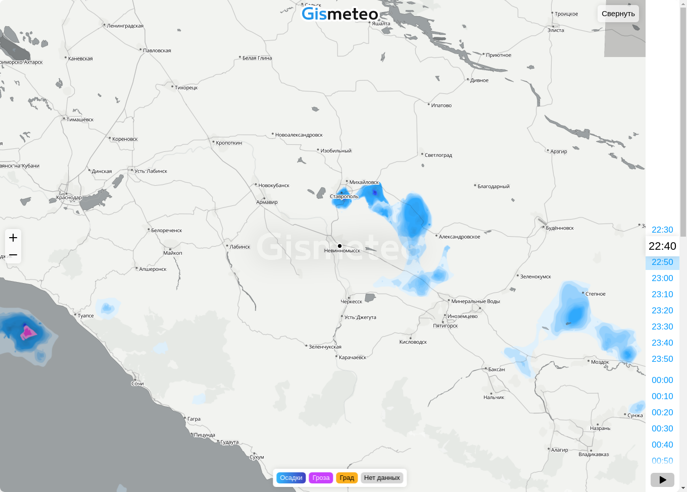
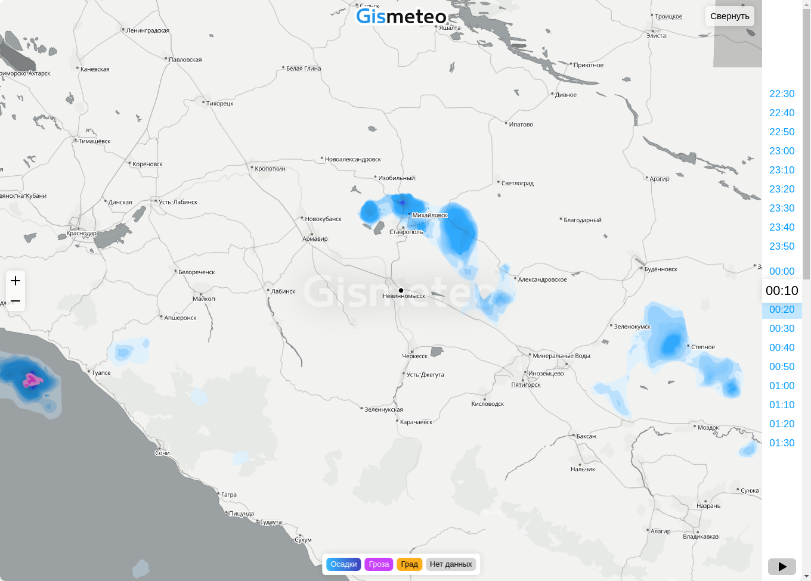
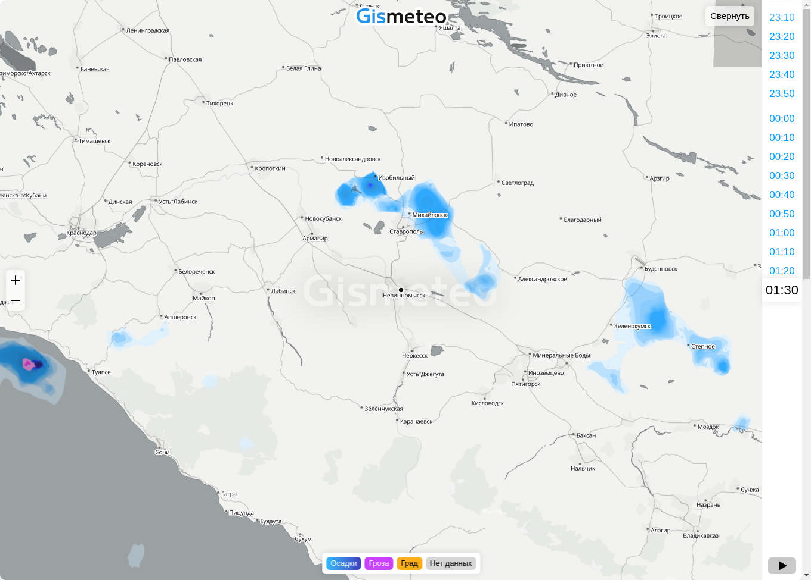
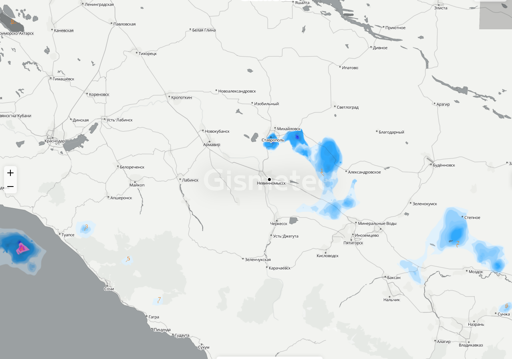
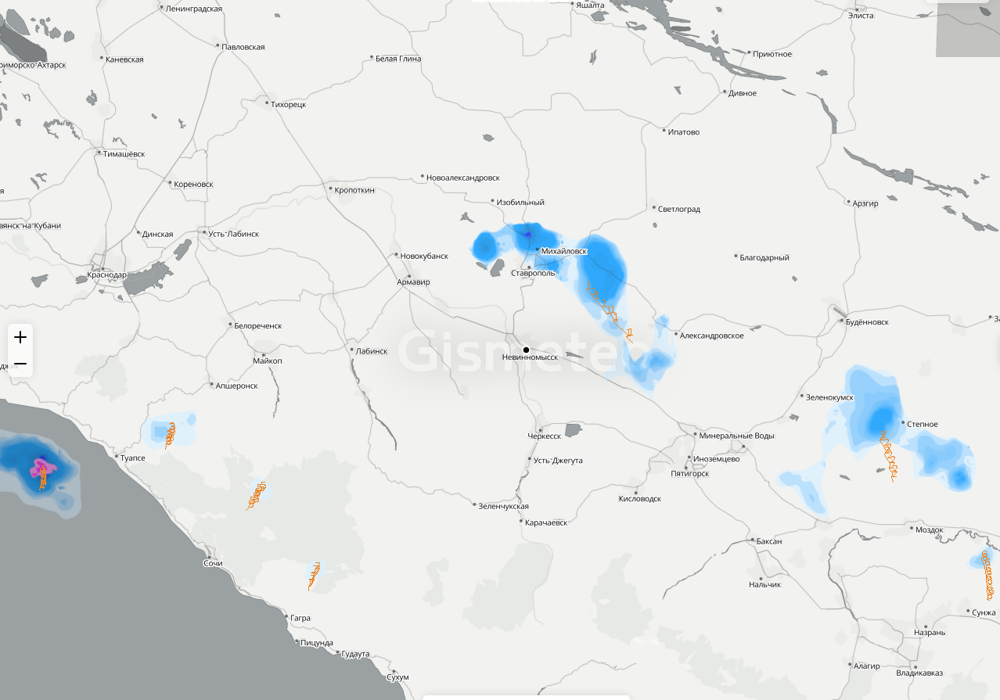
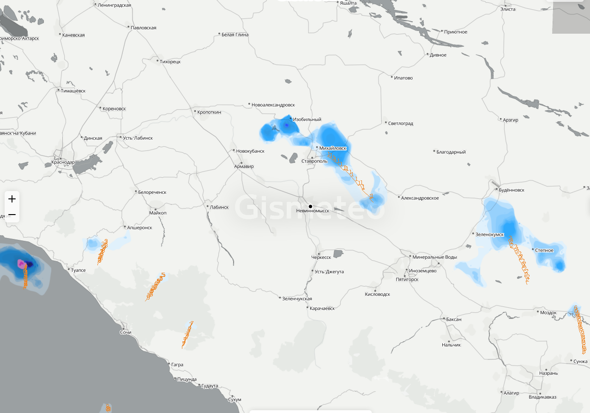

### Обработка кадров анимации погоды из карты осадков Gismeteo для выделения областей осадков и анализа их движения

По окончанию работы конвейера обработки запускается анимация из обработанных файлов.

Исходные кадры анимации нужно поместить в `resources/img/src`.

Путь к `resources/img` нужно задать в переменной `lofitsky.filler.FillerApp.Companion.IMAGES_ROOT`

Формат имён файлов: <общая_часть>-<zЗум>-<nПорядковый номер>-<ЧЧ:ММ>.png

Пример - id497172148-z0-n00-22-30.png

#### Пример работы

Исходные файлы:

Обработанные:

